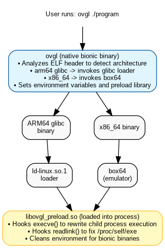

# ovgl

**ovgl** (onuverse Glibc Loader) runs **unpatched** glibc ARM64 and x86_64 binaries on Termux **without proot or any container**.

---

## Overview

Termux on Android uses **Bionic libc** (Android's C library), but many Linux binaries are compiled against **glibc** (GNU C Library). These binaries won't run directly on Termux because:

1. The ELF interpreter path (`/lib/ld-linux-aarch64.so.1`) doesn't exist on Android
2. Android's kernel execve() syscall fails to find the interpreter
3. Even if you invoke the loader manually, child processes spawned by the binary will fail

**ovgl** solves all these problems by:
- Invoking the glibc dynamic linker directly
- Intercepting `execve()` calls to redirect child processes through the glibc loader
- Fixing `/proc/self/exe` so binaries can find their resources

---

## Table of Contents

- [Overview](#overview)
- [How It Works](#how-it-works)
- [Complete Setup Guide](#complete-setup-guide)
  - [Step 1: Update Termux](#step-1-update-termux)
  - [Step 2: Install Required Packages](#step-2-install-required-packages)
  - [Step 3: Fix glibc libc.so Symlink](#step-3-fix-glibc-libcso-symlink)
  - [Step 4: Install ovgl](#step-4-install-ovgl)
  - [Step 5: Build ovgl](#step-5-build-ovgl)
  - [Step 6: Configure Shell](#step-6-configure-shell)
- [Usage](#usage)
- [Example: Running Geekbench 6](#example-running-geekbench-6)
- [Environment Variables](#environment-variables)
- [Technical Details](#technical-details)
- [Troubleshooting](#troubleshooting)
- [The Problem ovgl Solves](#the-problem-ovgl-solves)
- [License](#license)

## How It Works



## Installation

You have two installation options:

- Option 1 — Quick installer (recommended): download a prebuilt release and install automatically
- Option 2 — From source using `git` (build locally)

### Option 1 — Quick installer (curl)

Run the installer which downloads prebuilt `ovgl`, `box64`, and optional x86_64 libraries from the v0.0.1 release:

```bash
curl -sL https://theonuverse.github.io/ovgl/setup | bash
```

What the installer does:

- Updates packages (`pkg up`)
- Installs `glibc-repo`, `glibc`, and `wget`
- Fixes the `libc.so` symlink required by some glibc packages
- Downloads and installs `ovgl` to `$PREFIX/bin/`
- Downloads and installs `box64` to `$PREFIX/bin/` (if available)
- Extracts `x86_64` runtime libraries into `$PREFIX/glibc/lib_x86_64/` (if the archive exists)
- Downloads and installs the preload library to `$PREFIX/glibc/lib/`

### Option 2 — Build from source (git)

If you prefer building locally:

```bash
yes | pkg up
pkg ins glibc-repo clang -y
pkg ins glibc file git wget -y
cd ~ && git clone https://github.com/theonuverse/ovgl.git
cd ovgl
./build
```

The build script automatically installs `ovgl` to `$PREFIX/bin/` and `libovgl_preload.so` to `$PREFIX/glibc/lib/`.

## Usage

```bash
ovgl <binary> [args...]
```

### Options

| Flag | Description |
|------|-------------|
| `-d, --debug` | Show debug output |
| `-n, --no-preload` | Disable preload library |
| `-h, --help` | Show help |
| `-v, --version` | Show version |

### Examples

```bash
# Run arm64 glibc binary
ovgl ./geekbench6

# Run x86_64 binary (uses box64 automatically)
ovgl ./bedrock_server

# Debug mode
ovgl -d ./myapp

# Run without preload (for simple binaries)
ovgl -n ./simple_app
```

## Environment Variables

| Variable | Default | Description |
|----------|---------|-------------|
| `BOX64_LD_LIBRARY_PATH` | `$PREFIX/glibc/lib_x86_64` | x86_64 library search path |
| `OVGL_GLIBC_LIB` | `$PREFIX/glibc/lib` | glibc library path |
| `OVGL_GLIBC_LOADER` | `$PREFIX/glibc/lib/ld-linux-aarch64.so.1` | glibc loader |
| `OVGL_DEBUG` | unset | Set to `1` to enable debug output |
| `OVGL_ORIG_EXE` | (internal) | Original executable path for /proc/self/exe fix |

## Example: Running Geekbench 6

```bash
cd ~
wget https://cdn.geekbench.com/Geekbench-6.5.0-LinuxARMPreview.tar.gz
tar -xvf Geekbench-6.5.0-LinuxARMPreview.tar.gz
cd Geekbench-6.5.0-LinuxARMPreview

# Run without any patching!
ovgl ./geekbench6
```

## Technical Details

### Hooked Functions

| Function | Purpose |
|----------|---------|
| `execve()` | Main exec hook - rewrites glibc binary execution |
| `execv()` | Wrapper, calls execve() |
| `execvp()` | PATH resolution + execve() |
| `execvpe()` | PATH resolution + execve() with custom envp |
| `readlink()` | Fixes `/proc/self/exe` |
| `readlinkat()` | Fixes `/proc/self/exe` (fd variant) |

### ELF Detection

1. Check ELF magic bytes (`\x7fELF`)
2. Verify 64-bit ELF (`ELFCLASS64`)
3. Check architecture (aarch64 or x86_64)
4. Find `PT_INTERP` program header
5. Detect interpreter type (glibc, bionic, musl)

## Troubleshooting

### "Binary not found"

ovgl searches the current directory first, then PATH:

```bash
# These all work:
ovgl ./program
ovgl program      # if in current directory
ovgl /full/path/to/program
```

### Child process fails

Enable debug mode to see what's happening:

```bash
ovgl -d ./program
```

### Missing x86_64 libraries

For x86_64 binaries, ensure libraries are in `$PREFIX/glibc/lib_x86_64/`:

```bash
ls $PREFIX/glibc/lib_x86_64/
# Should contain: libgcc_s.so.1, libstdc++.so.6, etc.
```

## The Problem ovgl Solves

Running glibc binaries on Android/Termux is challenging because:

- **Interpreter Path Issue**: glibc binaries expect `/lib/ld-linux-aarch64.so.1`, but Android doesn't have this path
- **Kernel execve() Failure**: Android's kernel can't find the glibc interpreter, causing "No such file or directory" errors
- **Child Process Problems**: Even if you manually invoke the loader, child processes spawned by the binary will fail because they inherit the wrong environment
- **Resource Location**: Binaries that read `/proc/self/exe` to find their resources fail because the path points to the loader instead of the binary

ovgl addresses all these issues with a comprehensive solution that works for both ARM64 glibc and x86_64 binaries.

## License

MIT License - Copyright (c) 2026 onuverse


